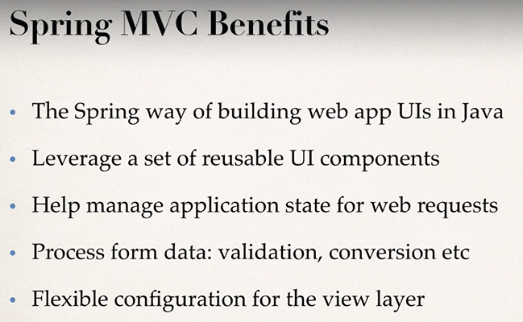

# **Spring MVC**

**Intro**
- framework for building web application
- based on model view controller design pattern
- leverages features of the core spring framework(IoC, DI)

**spring mvc official docs:**
https://docs.spring.io/spring-framework/docs/current/reference/html/web.html

_link for view options list:_
https://docs.spring.io/spring-framework/docs/current/reference/html/web.html#mvc-view

## **Components of spring MVC Application**
- A set of webpages to layout UI components
- A collection of Spring beans(controllers, services, etc..)
- Spring configuration (XML,Annotations or Java config)

## **Spring MVC Configuration Process**

Add configurations to file : WEB-INF/web.xml
1. Configure Spring MVC Dispatcher Servlet
2. Set up URL mappings to Spring MVC Dispatcher Servlet

<!-- Step 1: Configure Spring MVC Dispatcher Servlet -->
       <servlet>
            <servlet-name>dispatcher</servlet-name>
            <servlet-class>org.springframework.web.servlet.DispatcherServlet</servlet-class>
            <init-param>
                <param-name>contextConfigLocation</param-name>
                <param-value>/WEB-INF/spring-mvc-demo-servlet.xml</param-value>
            </init-param>
        <load-on-startup>1</load-on-startup>
       </servlet>

<!-- Step 2: Set up URL mapping for Spring MVC Dispatcher Servlet -->
    <servlet-mapping>
        <servlet-name>dispatcher</servlet-name>
        <url-pattern>/</url-pattern>
    </servlet-mapping>

Note: <servlet-name> value has to match in both the steps.
e.g dispatcher in above code.

Add configurations to file : WEB-INF/spring-mvc-demo-servlet.xml
3. Add support for spring component scanning
4. Add support for conversion, formatting and validation
5. Configure Spring MVC View Resolver

<!-- Step 3: Add support for component scanning -->
	<context:component-scan base-package="com.luv2code.springdemo" />

<!-- Step 4: Add support for conversion, formatting and validation support -->
	<mvc:annotation-driven/>

<!-- Step 5: Define Spring MVC view resolver -->
	<bean
		class="org.springframework.web.servlet.view.InternalResourceViewResolver">
		<property name="prefix" value="/WEB-INF/view/" />
		<property name="suffix" value=".jsp" />
	</bean>

**Spring MVC development Process steps**
1. Create controller class
2. Define controller method
3. Add request mapping to controller method
4. return view name
5. develop view page

